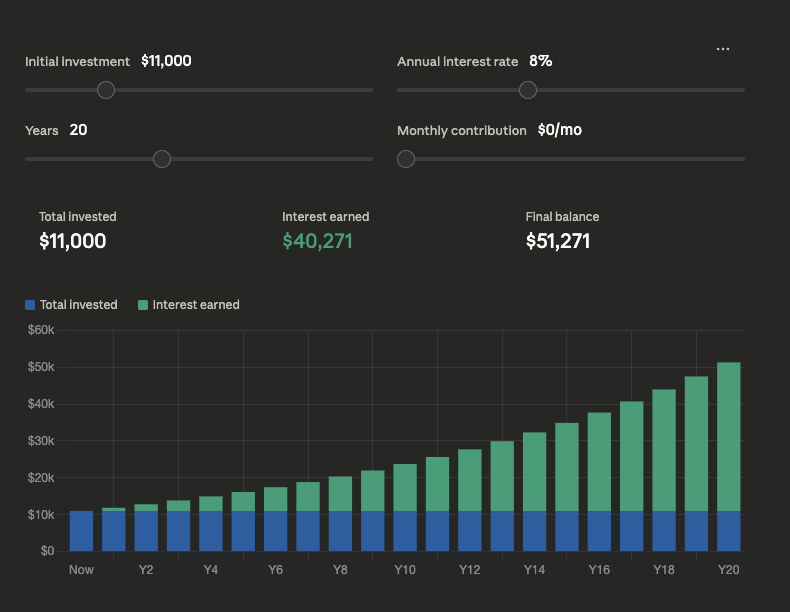

# Nigerian Financial Calculator

A modern, high-performance financial application built with Angular 21 designed specifically for the Nigerian market. This tool helps users plan their long-term wealth growth and understand their take-home income under the latest Nigerian tax regulations.



## 🌟 Key Features

### 1. Compound Interest Calculator
*   **Visualize Growth**: Real-time interactive bar charts showing the breakdown of principal vs. interest over time.
*   **Flexible Compounding**: Support for Monthly, Quarterly, Bi-Annual, and Annual compounding frequencies.
*   **Click-to-Edit Inputs**: Seamlessly toggle between sliders and direct numeric entry for precise control.
*   **Milestone Tracking**: Automatic detection of wealth doubling/tripling points (e.g., "2x Principal reached in Year 8").
*   **Yearly Breakdown**: Click any bar to see specific invested, interest, and total balance details for that year.
*   **Large Range Support**: Plan for the future with initial investments up to ₦1,000,000.

### 2. Nigeria Tax Calculator (2026 Rules)
*   **Latest Tax Bands**: Fully compliant with the **Nigeria Tax Act 2025** (effective January 1, 2026).
*   **Progressive PIT**: Calculates Personal Income Tax based on the updated step-function bands (₦800k exempt, then 15%, 18%, etc.).
*   **Two-Way Calculation**:
    *   **Income to Tax**: Enter your gross wage to see your net take-home and estimated tax.
    *   **Tax to Income**: Enter a target net tax amount to extrapolate the required gross income.
*   **Multi-Frequency Support**: Input and view results in Weekly (up to ₦1M), Monthly (up to ₦100M), or Annual (up to ₦1B) formats.
*   **Tax-Free Threshold**: Accurate extrapolation that accounts for the ₦800,000 annual tax-free allowance.

### 3. Dynamic Theme System
*   **3-Way Theme Selector**: Manual [☀️ Day], [🌙 Night], or [🖥️ System] modes to suit your preference.
*   **Time-Based Intensity**: Accent colors automatically shift throughout the day (Midnight Cyan, Morning Amber, Noon Violet, Evening Emerald).
*   **Glassmorphism UI**: Modern aesthetic with frosted glass effects and smooth transitions.

## 🛠️ Technical Stack

*   **Framework**: [Angular v21.2.6](https://angular.dev/) (Standalone Components, Signals API).
*   **State Management**: Fully reactive using **Angular Signals**.
*   **Visualization**: [Chart.js](https://www.chartjs.org/) for high-performance interactive graphing.
*   **Styling**: SCSS with CSS variable tokens for unified theme management.
*   **Build Tool**: Angular CLI / Vite.

## 🏗️ Architecture & Design

The application follows a clean, modular architecture optimized for maintainability:
*   **Smart/Dumb Component Pattern**: `AppComponent` orchestrates global state, while specialized sub-components handle presentational logic.
*   **Centralized Configuration**: All business rules (tax bands, default values, compounding frequencies) are stored in `src/app/app.constants.ts`.
*   **Pure Functional Logic**: All mathematical formulas (financial and tax) are isolated in `src/app/app.utils.ts` for portability and testing.
*   **Layout Separation**: Core layout elements like the `NavbarComponent` are decoupled from functional logic and reside in `src/app/layout/`.
*   **Reactive Navigation**: Decoupled tab management using `NavigationService`.

## 🚀 Getting Started

### Prerequisites
*   Node.js (v21+ recommended)
*   npm

### Installation
1. Clone the repository.
2. Install dependencies:
   ```bash
   npm install
   ```

### Development Server
Run the local development server:
```bash
npm start
```
Navigate to `http://localhost:4200/`. The app will automatically reload on source changes.

### Building for Production
To build the project:
```bash
npm run build
```
The build artifacts will be stored in the `dist/` directory.

## 📊 Business Rules (Nigeria Tax Act 2026)

The app implements the following progressive tax bands:

| Annual Income Band | Tax Rate |
|-------------------|----------|
| First ₦800,000    | 0% (Exempt) |
| Next ₦2,200,000   | 15% |
| Next ₦9,000,000   | 18% |
| Next ₦13,000,000  | 21% |
| Next ₦25,000,000  | 23% |
| Above ₦50,000,000 | 25% |

---
*Created with focus on human readability and ease of maintenance.*
